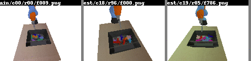

# pybullet grasping with time contrastive network embeddings

see [the blog post](http://matpalm.com/blog/pybullet_tcn_grasping) for more details



## deps

* pybullet
* some urdfs for objects to grasp. a copy of the `objs` directory from https://github.com/matpalm/procedural_objects/ will get you started

## generate images

### synthetic r/g/b squares

```
./generate_toy_rgb_data.py
```

### small set

```
./run_random_grasps.py --run 1 --num-cameras 4 --max-frames-to-render 10 &
./run_random_grasps.py --run 2 --num-cameras 4 --max-frames-to-render 10 &
wait
```

##  debugging / review images

display a 5x5 sample of random frames

```
./debug_random_frames.py
```

display a sample of images across frames / cameras
columns are a frame in time, rows are specific cameras

```
./debug_frame_sequence_cameras.py --run 1 --initial-frame 1 --num-frames 4 --cameras 0,1,2,3
```

show all camera images for a specific frame

```
./debug_frame.py --run 1 --frame 10
```

show random (anchor, positive, negative) triples that will be used for training

```
./debug_random_triples.py
```

## training model

```
./train.py --help

  --img-dir IMG_DIR
  --batch-size BATCH_SIZE
                        note: effective batch is x3 (default: 16)
  --embedding-dim EMBEDDING_DIM
                        image embedding dim (default: 8)
  --learning-rate LEARNING_RATE
                        learning rate for adam (default: 0.001)
  --epochs EPOCHS
  --steps-per-epoch STEPS_PER_EPOCH
  --model-output MODEL_OUTPUT
                        where to save model (default: model)
```

## working with embeddings

calc embeddings for all images

```
./embed_imgs.py
```

debug near neighbours

```
./debug_embedding_near_neighbours.py
```
